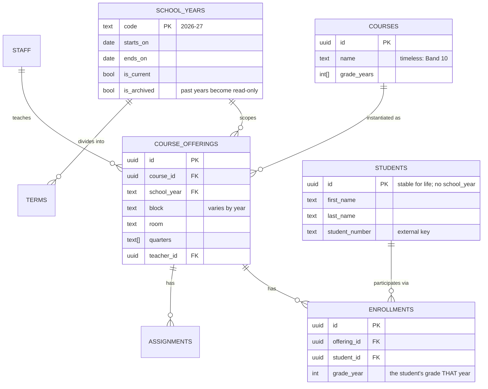

# CourseBoard — Multi-Year Data Architecture

Goal: one system that accumulates a teaching career's worth of records — many
school years, new timetables and new students each year — without rewriting
history or duplicating people.

This document describes the **target** model and the gap between it and today.
Nothing here has been applied beyond `rcs.course_blocks`.

---

## 1. What breaks today

Each of these is observed in the live database, not hypothetical.

| # | Problem | Evidence | Consequence in year 2+ |
|---|---|---|---|
| 1 | Year-specific facts stored on the course row | `rcs.courses.school_years` is an array with a single `block` column | A course in two years cannot hold two blocks. Patched with `course_blocks`; the same patch will be needed for room, teacher, section… |
| 2 | Quarters have no school year | `public.school_quarters` = 4 rows, ids 1–4, dates hard-coded to 2025-26 | Next year overwrites this year's dates. Quarter history is lost permanently |
| 3 | Student identity is year-scoped | `public.students.school_year` | A returning student becomes a second row. No way to follow a student across years |
| 4 | Two competing course tables | `public.courses` (33) and `rcs.courses` (25), `public_course_id` NULL on all 25 | Two sources of truth that already disagree (2025-26 ICT 9 / Computer Studies 10) |
| 5 | Two competing student tables | `public.students` (145) and `rcs.students` (5) | Enrollments resolve 185/186 to `public.students`. Querying the wrong one silently returns almost nothing |
| 6 | Missing referential integrity | No FK on `rcs.enrollments.student_id` | 1 of 186 enrollments already points at a non-existent student. Nothing prevents more |
| 7 | Flat authorisation | Every `rcs.*` policy is `ALL` to `authenticated` using `true` | Any signed-in account reads every student in every year. No per-teacher scoping, no read-only past |
| 8 | Free-text years | `'2025-26'` as a string in courses, enrollments, students, course_blocks | A typo creates a silent phantom year. No canonical list to drive the UI |

---

## 2. Target model

The organising idea: **separate the timeless thing from its yearly instance.**

A *course* ("Band 10") is timeless. A *course offering* ("Band 10, 2026-27,
block D, room 130") is the yearly instance. Everything year-specific — block,
room, quarters, enrollments, assignments — hangs off the offering.

Likewise a *student* is a person who persists; an *enrollment* is that person's
yearly participation.



### Why each change earns its place

**`school_years` as a table, not a string.** Gives a canonical list to drive the
year selector, a home for term dates, and — critically — an `is_archived` flag
that RLS can enforce. Every year reference becomes a foreign key, so a typo
fails loudly instead of creating a phantom year.

**`course_offerings` replaces `school_years[]` and `course_blocks`.** Any
attribute that varies by year now has an obvious home. This is the change that
stops the recurring "add another side table" cycle — `course_blocks` was
already the first instance of it.

**`students` loses `school_year`; `enrollments` gains `grade_year`.** A student
is one row forever. Their grade level is a property of a given year's
enrollment, not of the person. This is what makes "show me this student across
four years" possible — and it is much harder to retrofit later, once duplicate
rows exist.

**Assignments attach to `offering_id`.** Today they attach to `course_id`, so an
assignment cannot be attributed to a year when the course spans two.

---

## 3. Security model

Current policies grant every authenticated user unrestricted access to all
student data. Two changes:

**Scope by teacher.** A teacher reads the offerings they teach and the students
enrolled in them; an admin role sees everything.

```sql
create policy "teacher reads own offerings"
  on course_offerings for select to authenticated
  using (teacher_id = auth.uid() or is_admin());

create policy "teacher reads enrolled students"
  on enrollments for select to authenticated
  using (exists (
    select 1 from course_offerings o
    where o.id = enrollments.offering_id
      and (o.teacher_id = auth.uid() or is_admin())
  ));
```

**Make past years read-only.** Once a year is archived, writes are refused at
the database level, so a stray UI action cannot rewrite a completed year:

```sql
create policy "no writes to archived years"
  on enrollments for all to authenticated
  using (true)
  with check (not exists (
    select 1 from course_offerings o join school_years y on y.code = o.school_year
    where o.id = enrollments.offering_id and y.is_archived
  ));
```

This is the single highest-value safeguard for a multi-year archive: history
becomes structurally immutable rather than immutable by convention.

---

## 4. The yearly rollover

With this model, starting a new year is a routine operation rather than a
schema edit:

1. Insert the new `school_years` row; set `is_current`.
2. Copy forward the offerings that repeat, editing block/room as the timetable
   changes. Courses themselves are untouched.
3. Import the year's students — matching existing people by `student_number`
   so returners keep their identity — and create enrollments.
4. Archive the prior year.

Steps 2–4 are worth a `roll_over_year()` function once the shape settles.

---

## 5. Migration path

Ordered so that each step is independently safe and reversible.

| Step | Change | Risk |
|---|---|---|
| 1 | Create `school_years`, backfill from distinct strings in use | None — additive |
| 2 | Create `course_offerings`, backfill from `rcs.courses` × `course_blocks` | None — additive |
| 3 | Point the app at `course_offerings`; keep old tables in place | Low — reversible by redeploy |
| 4 | Add `offering_id` to `enrollments`/`assignments`, backfill, then add FKs | Medium — needs care with the 1 orphan enrollment |
| 5 | Consolidate `rcs.students` into `public.students`; drop `students.school_year` | Medium — do while only one year of data exists |
| 6 | Replace flat RLS with scoped policies + archive enforcement | Medium — test with a non-admin account first |
| 7 | Retire `rcs.courses` / `rcs.students` | Low — after 3–6 are proven |

**Step 5 is time-sensitive.** Only 2025-26 data exists today, and no student
name repeats. Splitting one student into per-year rows has not happened yet, so
fixing identity now costs almost nothing. After a second year is imported it
becomes a genuine data-reconciliation project.
